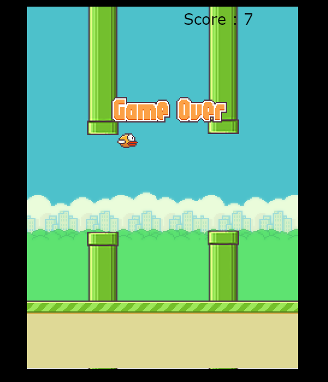

# FlappyBird-Clone

**Flappy Bird** is a addicting side-scroller where the player controls a bird, attempting to fly between columns of green pipes without hitting them. This is my attempt to clone the Flappy Bird Game.

__Demo : *https://binish784.github.io/FlappyBird-Clone/*__

### Project Details
This project is built with **_Javascript_** using **_ES6 Classes_**, **_HTML CANVAS_** for rendering the game screen. For the game engine, **_Fixed time Step Game Loop_** is implemented.

<b>Technologies: </b>
* ES6 javascript
* HTML CANVAS

### Additional Features
* Two Bird Variations
* Touch Responsive
* Responsive Canvas

### Screenshot

